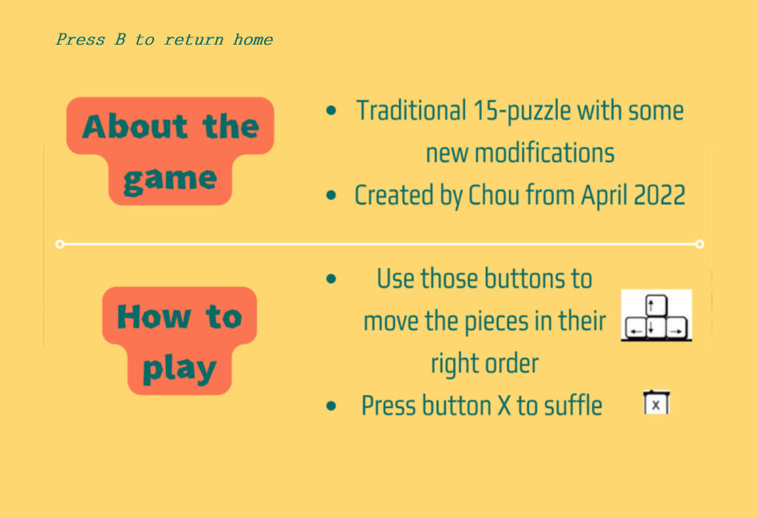
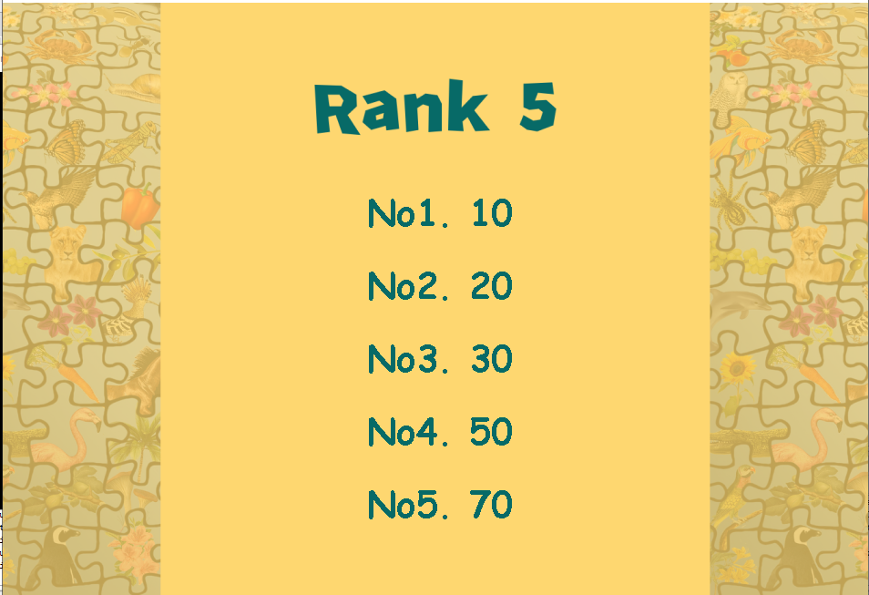
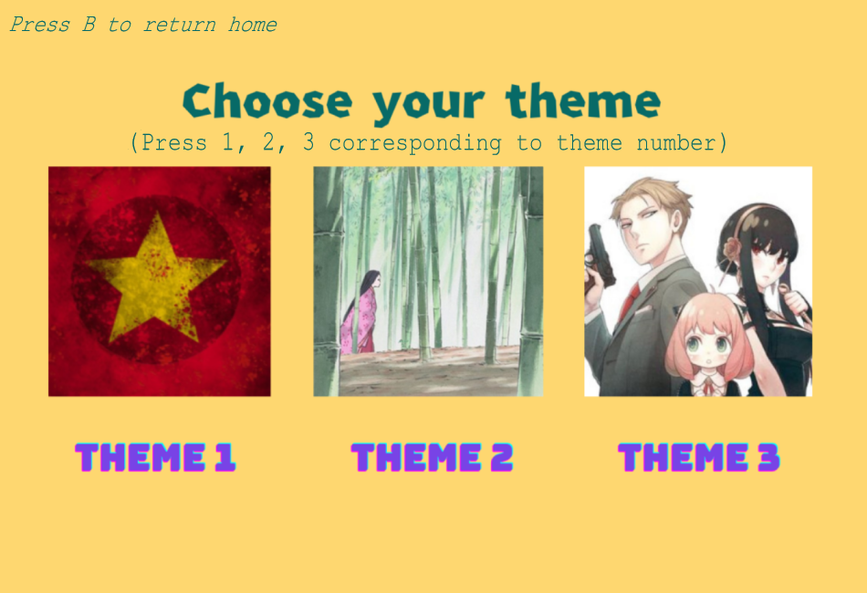
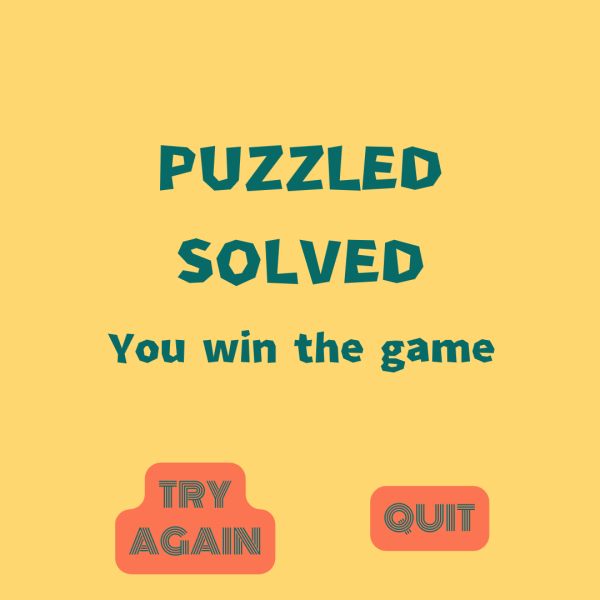

# ***Sliding Puzzle***

## **Introduction**

+ Mã sinh viên:  21020286 - Lê Minh Châu - K66CB - UET

+ Bài tập lớn - Sliding Puzzle (INT2215 1 - Lập trình nâng cao)

## **Description**

### *Game description and rule*

- Đây là trò chơi xếp hình trong khung 4x4 với 15 ô ảnh bị xáo trộn. Nhiệm vụ của bạn là sắp xếp những ô ảnh về đúng thứ tự bằng cách di chuyển phím lên trên, xuống dưới, trái, phải.

- Game gồm 3 chủ đề hình ảnh với background tương ứng để bạn tuỳ ý lựa chọn.

### *Controls and Options*

| Option         | Key       |
|----------      |-----------|
| Shuffle Puzzle | x |
| Return to home | b |

| Control | Key   |
|---------|-------|
| UP      | ↑     |
| DOWN    | ↓     |
| LEFT    | ←     |
| RIGHT   | →     |

### *Preview*

## **Setup**

- *Cài đặt*
  1. Vào đường link sau:  https://vnueduvn-my.sharepoint.com/:f:/g/personal/21020286_vnu_edu_vn/EnpA1Ovso5JGi5Dd0GZ8oVQBhKGn0ykcEy9wClbzr-Dpsg?e=oSJ53d
  
  2. Tải file **"Release"** và giải nén.

  3. Vào file vừa tải về, chọn file **"Setup.exe"**, sau đó cài đặt theo hướng dẫn của chương trình.

  4. Thoát ra màn hình chính, vào game bắt đầu chơi.

- *Khi gặp lỗi "The code execution cannot proceed because ....dll was not found. Reinstalling the program may fix this problem.":*

  1. Truy cập vào đường link ở trên, tải về file **"System32"** và **"SysWOW64"** và giải nén file vừa tải về.

  2. Copy file .dll  trong file **"System32"** đưa vào trong thư mục **"C:\Windows\System32"**, file .dll  trong file **"SysWOW64"** đưa vào trong thư mục **"C:\Windows\SysWOW64"**.

  3. Khởi chạy lại game vừa cài đặt

- *Mọi khó khăn trong việc cài đặt, trong quá trình chơi, hay gỡ bỏ, hãy email qua 21020286@vnu.edu.vn.*

## **See also**

### *Các kĩ thuật sử dụng*

- Thư viện SDL2.0.

- Tạo các đối tượng: các ô ảnh, ...

- Tạo các đối tượng phụ: số lượt di chuyển...

- Xử lí thời gian, tương tác với chuột và bàn phím, có âm thanh.

- Tạo các menu: Bắt đầu, kết thúc, lựa chọn chủ đề, hướng dẫn,...

- Đóng gói chương trình để có thể cài đặt, chơi được ở các máy tính thông thường.

### *Mức điểm tự đánh giá: 9/10.*

### *Nguồn tham khảo:*
- Logic game em tự nghĩ.

- https://lazyfoo.net/tutorials/SDL/index.php (thư viện SDL2.0, ...)

- https://phattrienphanmem123az.com/lap-trinh-game-cpp (tile map, tạo menu).
- Một số hình ảnh tự design và âm thanh tìm ở trên web -.-
https://www.wavsource.com/sfx/sfx.htm,
https://vi.pngtree.com/

